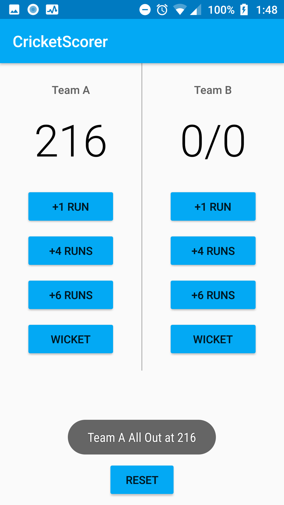

# Cricket Scorer

The App Looks Like This:

Where +1,+4,+6 runs can be added.The reset button resets the score of both the teams.

When the number of wickets becomes 10 the team gets all out with a toast message displaying the final score.

